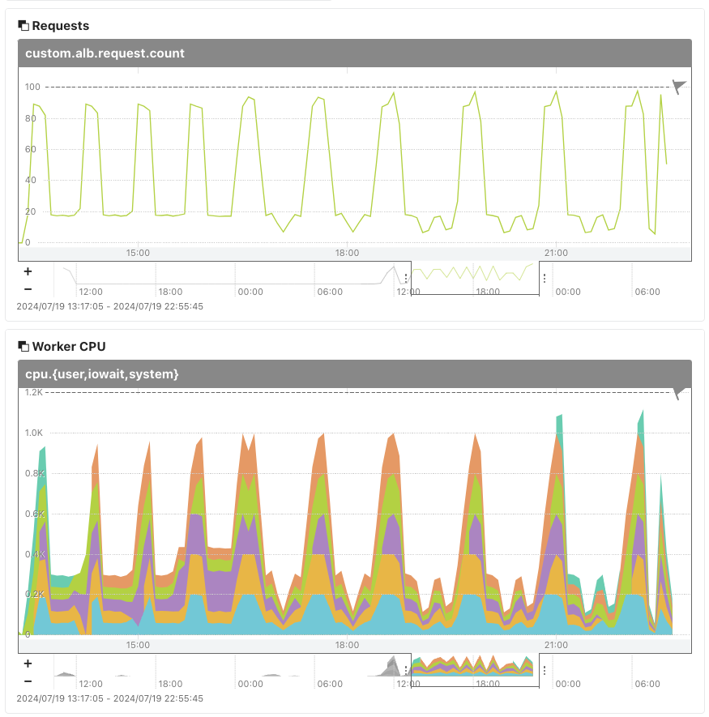

# saba-load-requester

**saba-load-requester**は、[Mackerel](https://ja.mackerel.io)のホストメモ情報に記載された命令をもとに、特定のHTTPサーバーへのHTTPリクエストを増減させるデーモンです。

## 設定

[mackerel-agent](https://mackerel.io/ja/docs/entry/howto/install-agent)を実行しているLinuxホスト上にこのリポジトリを展開します。

さらに、`mkr`も[導入](https://mackerel.io/ja/docs/entry/advanced/cli)しておきます。

`config.rb-tmpl`を`config.rb`としてコピーし、内容を編集します。

例
```
LB_URL = 'http://alb.internal.example.com/stress/1/5'
MINUTES = 5
MINUS_RANGE = 5

@config = {
  'lowload' => [20],
  'highload' => [90],
  'spike' => [90, 90, 100, 90, 20, 20, 20, 10, 10, 20, 20, 10, 10, 20],
  'smallspike' => [100, 50, 20, 20, 10, 10, 20, 20, 10, 10, 20],
  'wave' => [20, 20, 30, 30, 40, 40, 50, 50, 60, 60, 70, 70, 80, 80, 90, 80, 80, 70, 70, 60, 60, 50, 50, 40, 40, 30, 30]
}

DEFAULT_MODE = 'smallspike'
```

- `LB_URL`: リクエスト先のURL。ここでは[saba-memo-runner](https://github.com/kmuto/saba-memo-runner)による負荷テストをバックエンドで実行するロードバランサーを例にしている
- `MINUTES`: リクエスト制御1設定あたりの分数。ここでは5
- `MINUS_RANGE`: 1分あたりのリクエスト回数からランダムに引く値の上限。ここでは5
- `@config`: リクエスト制御の名前および`MINUTES`分内での各分の最大リクエスト回数
- `DEFAULT_MODE`: 指定がないときのデフォルトのリクエスト制御名

上記の設定において、`smallspike`をデフォルトのリクエスト制御名としたので、`[100, 50, 20, 20, 10, 10, 20, 20, 10, 10, 20]`が使われるリクエスト制御となります。

最初の値は100ですが、`MINUTES`が5なので、毎分最大100リクエストを、5分間実行します。さらに`MINUS_RANGE`が5なので、リクエスト回数を100よりも0〜5減らします（ランダム）。

- 1分目: 100 - (0〜5) 回のリクエスト
- 2分目: 100 - (0〜5) 回のリクエスト
- 3分目: 100 - (0〜5) 回のリクエスト
- 4分目: 100 - (0〜5) 回のリクエスト
- 5分目: 100 - (0〜5) 回のリクエスト

次の値は50なので、6分目からは次のようになります。

- 6分目: 50 - (0〜5) 回のリクエスト
- 7分目: 50 - (0〜5) 回のリクエスト
- 8分目: 50 - (0〜5) 回のリクエスト
- 9分目: 50 - (0〜5) 回のリクエスト
- 10分目: 50 - (0〜5) 回のリクエスト

リクエスト回数が0以下になるときにはリクエストは実行されません。

## 実行

`ruby saba-load-requester.rb`で実行します。

Mackerel上のホストメモに、`highload`や`wave`といったリクエスト制御名を行として記述することで、挙動が変わります。



常駐化のためにはsystemdのユニットファイルのサンプルを`systemd`フォルダに入れているので、`User`や`WorkingDirectory`を適宜変更してご利用ください。

## ライセンス
```
Copyright (c) 2024 Kenshi Muto

Permission is hereby granted, free of charge, to any person obtaining a copy
of this software and associated documentation files (the "Software"), to deal
in the Software without restriction, including without limitation the rights
to use, copy, modify, merge, publish, distribute, sublicense, and/or sell
copies of the Software, and to permit persons to whom the Software is
furnished to do so, subject to the following conditions:

The above copyright notice and this permission notice shall be included in
all copies or substantial portions of the Software.

THE SOFTWARE IS PROVIDED "AS IS", WITHOUT WARRANTY OF ANY KIND, EXPRESS OR
IMPLIED, INCLUDING BUT NOT LIMITED TO THE WARRANTIES OF MERCHANTABILITY,
FITNESS FOR A PARTICULAR PURPOSE AND NONINFRINGEMENT. IN NO EVENT SHALL THE
AUTHORS OR COPYRIGHT HOLDERS BE LIABLE FOR ANY CLAIM, DAMAGES OR OTHER
LIABILITY, WHETHER IN AN ACTION OF CONTRACT, TORT OR OTHERWISE, ARISING FROM,
OUT OF OR IN CONNECTION WITH THE SOFTWARE OR THE USE OR OTHER DEALINGS IN
THE SOFTWARE.
```
